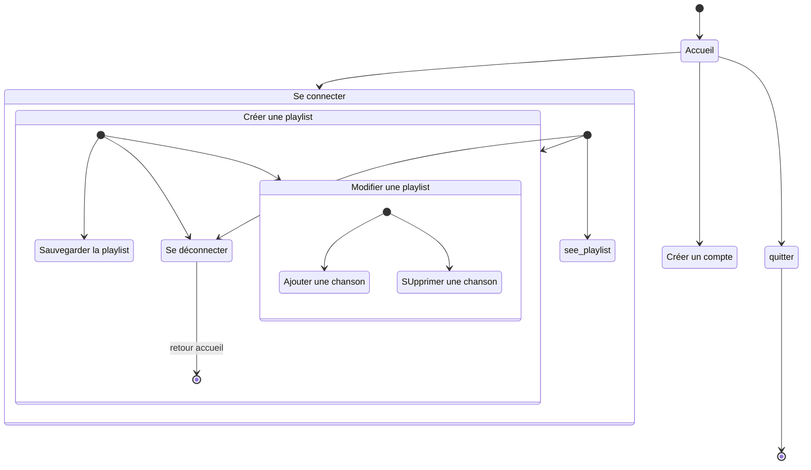

# Diagramme d'activité

> Ce diagramme UML d'activité modélise le flux de travail d'un processus, il montre la séquence d'activités et de décisions dans notre système. Il illustre comment les actions s'enchaînent et comment les choix sont faits.

