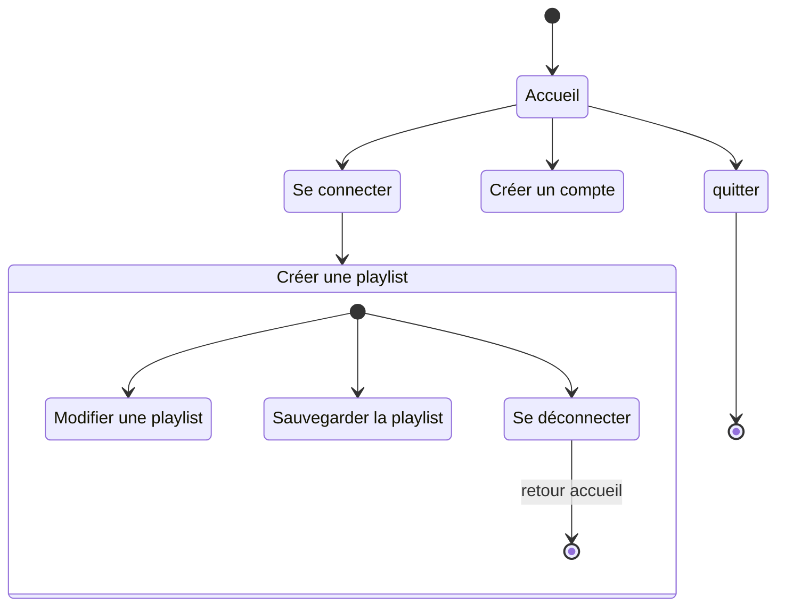

# Diagramme d'activité
stateDiagram-v0
[*]--> Accueil
Accueil --> Se connecter
Accueil --> Créer un compte
Accueil --> Quitter
Se connecter --> Créer une playlist
Se connecter --> Voir sa playlist
Se connecter --> Se déconnecter 
Créer une playlist --> Sauvegarder la Playlist
Créer une playlist --> Modifier la Playlist
Modifier la Playlist --> Sauvegarder la Playlist
Sauvegarder la Playlist --> [*]

> Ce diagramme UML d'activité modélise le flux de travail d'un processus, il montre la séquence d'activités et de décisions dans notre système. Il illustre comment les actions s'enchaînent et comment les choix sont faits.

