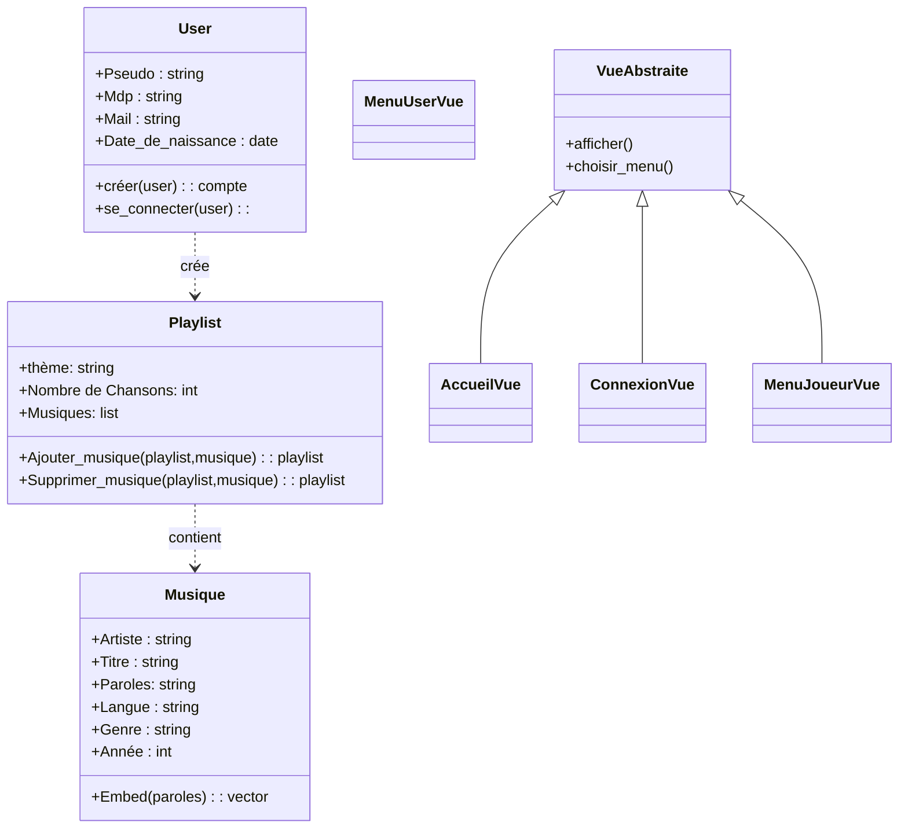

# Diagramme de classes des objets métiers

```mermaid
classDiagram
    class Playlist {
        +thème: string
        +Nombre de Chansons: int
        +Musiques: list
        +Ajouter_musique(playlist,musique): playlist
        +Supprimer_musique(playlist,musique): playlist
    }
    
    class User {
        +Pseudo : string
        +Mdp : string
        +Mail : string
        +Date_de_naissance : date
        +créer(user): compte
        +se_connecter(user):     
    }
    
    class Musique {
        +Artiste : string
        +Titre : string
        +Paroles: string
        +Langue : string
        +Genre : string
        +Année : int
        +Embed(paroles): vector
    }

    class AccueilVue {
    }
    
    class ConnexionVue {
    }

    class MenuUserVue {
    }

    class VueAbstraite{
      +afficher()
      +choisir_menu()
    }

    VueAbstraite <|-- AccueilVue
    VueAbstraite <|-- ConnexionVue
    VueAbstraite <|-- MenuJoueurVue
    User ..> Playlist: crée
    Playlist ..> Musique: contient
```
